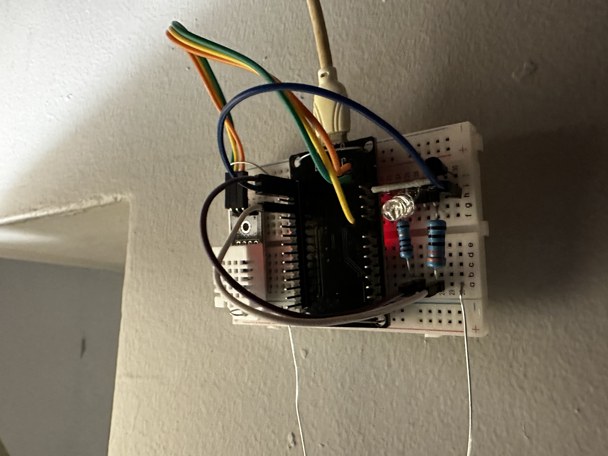

# IOTServer




## Climate Control Web Interface

IOTServer started out as a simple POC (Proof Of Concept) pet project to turn an
LED on and off using a web interface. However, since that does nothing really
useful, I decided to expand it into a Climate Control server.


### Introduction

ESP32 is a series of low-cost, low-power system-on-chip microcontrollers with
integrated Wi-Fi and dual-mode Bluetooth
(Source: [Wikipedia entry](https://en.wikipedia.org/wiki/ESP32)).
It provides a fairly low cost entry into the field of *IoT*.

This project creates a fairly low cost solution to control an air conditioner
to prevent the compressor from running non-stop and consuming excessive
electricity.


### Requirements

In order to compile and run this test, you will need:
* Mac OS or Linux (I have only tested this on an Ubuntu 24.04 machine)
* [ESP32 microcontroller board](https://www.espressif.com/en/products/socs/esp32)
* [Arduino IDE](https://www.arduino.cc/en/Main/Software) or [Arduino CLI](https://github.com/arduino/arduino-cli)


### Building IndexHtml.h

You may have noticed that when you try to compile the code, that IndexHtml.h is missing:

```
pushd web && ./integrate && popd
~/Personal/IOTServer/web ~/Personal/IOTServer
node:internal/modules/cjs/loader:1242
  throw err;
  ^

Error: Cannot find module 'html-minifier'
Require stack:
- /home/user/Personal/IOTServer/web/integrate
    at Module._resolveFilename (node:internal/modules/cjs/loader:1239:15)
    at Module._load (node:internal/modules/cjs/loader:1065:27)
    at Module.require (node:internal/modules/cjs/loader:1325:19)
    at require (node:internal/modules/helpers:179:18)
    at Object.<anonymous> (/home/user/Personal/IOTServer/web/integrate:5:22)
    at Module._compile (node:internal/modules/cjs/loader:1483:14)
    at Module._extensions..js (node:internal/modules/cjs/loader:1562:10)
    at Module.load (node:internal/modules/cjs/loader:1302:32)
    at Module._load (node:internal/modules/cjs/loader:1118:12)
    at Function.executeUserEntryPoint [as runMain] (node:internal/modules/run_main:174:12) {
  code: 'MODULE_NOT_FOUND',
  requireStack: [ '/home/user/Personal/IOTServer/web/integrate' ]
}

Node.js v20.18.0
make: *** [Makefile:14: IndexHtml.h] Error 1
```

In order to build `IndexHtml.h`, you will need [NodeJS](https://nodejs.org/en/)
and either `npm` or `yarn` installed so that you can install the dependencies:

Using `npm`:
```
cd web
npm install
```

Using `yarn`:
```
cd web
npm install
```

From then on you should be able to and compile everything.


### Compiling

Compiling the project is as simple as running `make` (tested on Ubuntu 24.04).


### Uploading To ESP32

Uploading to ESP32 is a simple matter of running `make upload` (tested on Ubuntu 24.04)
