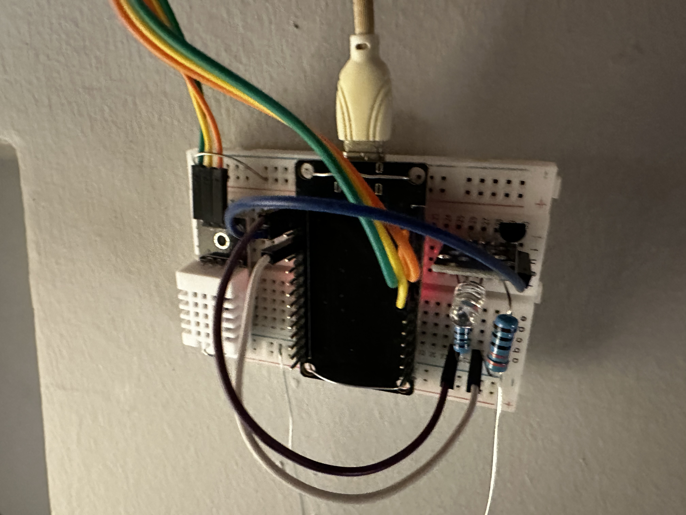

# IoT Climate Control for Wall-Mounted Air Conditioner

[](https://opensource.org/licenses/MIT)
[](https://espressif.com)

---

## Introduction

Wall-mounted air conditioners are convenient and widely used appliances, but they often struggle with inefficiencies that affect both comfort and energy consumption. This project introduces an intelligent, IoT-based climate control system that optimizes air conditioner operation by addressing these inefficiencies.

---

## Problem Statement

Wall-mounted air conditioners rely on temperature probes located near their intake vent—typically high up on the wall. This design introduces two significant issues:

1. **Inaccurate Temperature Measurement**
   The temperature probe measures air closer to the ceiling, which is unrepresentative of the room's true ambient temperature, especially at the human comfort level. This can result in difficulty achieving the desired room temperature, leading to:
   - Overcooling or overheating.
   - The compressor running for extended periods without reaching the target.

2. **Excessive Energy Consumption**
   Prolonged compressor operation leads to skyrocketing electricity costs, especially in regions where energy prices are high. This inefficiency stems directly from the flawed measurement setup.

---

## The Solution

This project provides a **wall-mounted climate control device** designed to address these challenges. The device is installed on the wall opposite the air conditioner's blower unit and features the following:

- **Integrated Temperature/Humidity Sensor:** Positioned at chest level to provide accurate, representative readings of the room's temperature and humidity.
- **Compressor Control:** Intelligently manages the air conditioner’s compressor to optimize runtime and minimize energy consumption.
- **Energy Efficiency:** By preventing unnecessary compressor operation, this device significantly reduces energy usage without compromising comfort.
- **IoT Integration:** Enables remote monitoring and control of the air conditioner through an easy-to-use web interface.

---

## Features

- **Energy Savings:** Prevents overuse of the compressor by ensuring optimal runtime.
- **Accurate Temperature Monitoring:** Uses a DHT22 (or similar) temperature/humidity sensor to track the room's environmental conditions.
- **Web Control:** Includes a user-friendly interface for setting temperature thresholds and monitoring system status.
- **Customizable and Open Source:** Fully open-source project based on the ESP32, allowing customization and contributions.

### Physical Prototype Circuit
Here’s a picture of the physical prototype circuit built for this project:


---

## Bill of Materials (BOM)

To build this climate control device, you will need the following components:

- **ESP32 Board**: Any ESP32-based development board will work. (This project uses the 30-pin ESP-32-WROOM.)
- **2N2222 NPN Transistor**: Used to drive the IR LED for communication with the air conditioner.
  - **Why a Transistor Is Necessary:**
    1. The GPIO pin on the ESP32 can only supply limited current (typically 20mA, max 40mA), which is insufficient to drive the IR LED effectively.
    2. Overloading the GPIO pin could damage the ESP32.
    3. The transistor acts as a switch, allowing the IR LED to draw sufficient current directly from the power supply without affecting the GPIO pin.
- **330 Ω Resistor**: Limits the base current to the 2N2222 transistor.
- **10 Ω Resistor**: Limits current through the IR LED to prevent damage.
- **IR LED**: Transmits signals to the air conditioner. Connect between the 10 Ω resistor and the collector of the 2N2222.
- **DHT22 Sensor**: Combines temperature and humidity sensing for environmental readings.
- **5V DC Power Supply (1A recommended):** Powers the ESP32 and associated circuitry.

---

### IR LED Driver Circuit Schematic
Below is the schematic of the IR LED driver circuit used to transmit signals to the air conditioner:


---

## Web Interface

The device features an intuitive web interface for monitoring and controlling the air conditioner.
Here’s a screenshot of the web interface:


---

## Getting Started

### Hardware and Software Requirements

You will need the following tools to set up and deploy this project:

- A computer running Mac OS or Linux (tested on Ubuntu 24.04).
- [ESP32 Microcontroller Board](https://www.espressif.com/en/products/socs/esp32).
- [Arduino CLI](https://github.com/arduino/arduino-cli) for uploading the firmware.
- [Node.js](https://nodejs.org/en/) and npm or yarn for compiling the web interface.

---

### Setup Instructions

1. **Clone and Compile the Project:**
   ```bash
   git clone https://github.com/alidrus/IOTServer.git
   cd IOTServer
   ```

2. **Build `IndexHtml.h`:**
   Navigate to the `web` folder and install dependencies:
   Using `npm`:
   ```bash
   cd web
   npm install
   ```
   Using `yarn`:
   ```bash
   cd web
   yarn install
   ```
   Run the integration script to build `IndexHtml.h`:
   ```bash
   ./integrate
   ```

3. **Compile and Upload to ESP32:**
   Use `make` to compile the project and `make upload` to flash it to your ESP32:
   ```bash
   make
   make upload
   ```

---

## How It Works

1. The system continuously monitors the room’s actual temperature and humidity using the onboard sensor.
2. Based on the desired temperature threshold set by the user, the device sends IR signals to the air conditioner to control its operation.
3. Intelligent control prevents the compressor from running unnecessarily, conserving energy while maintaining comfort.

---

## Roadmap

- Add support for **Google Home integration**.
- Develop a **more advanced web interface**.
- Integrate **power monitoring** to track energy usage and savings.
- Enable **Home Assistant integration** for expanded automation possibilities.

---

## Contributing

Contributions are welcome! If you have ideas or suggestions to improve this project, feel free to open an issue or submit a pull request.

---

## License

This project is licensed under the MIT License - see the [LICENSE](LICENSE) file for details.

---

## Acknowledgments

Special thanks to everyone in the open-source community for their support and contributions.
